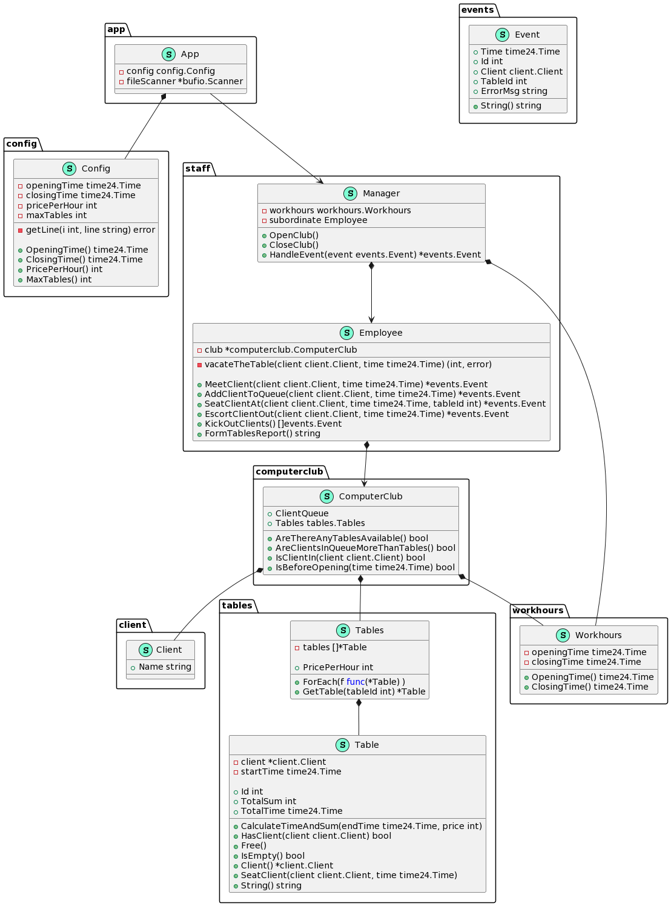

# Инструкция

## Сборка docker образа
```
make build
```

## Запуск приложения в контейнере
Входной файл указывается в виде абсолютного пути через переменную `FILE`, пример:
```
make run FILE=$(PWD)/testdata/1.txt
```

## Остальные команды
```
make help
```

# Структура проекта
